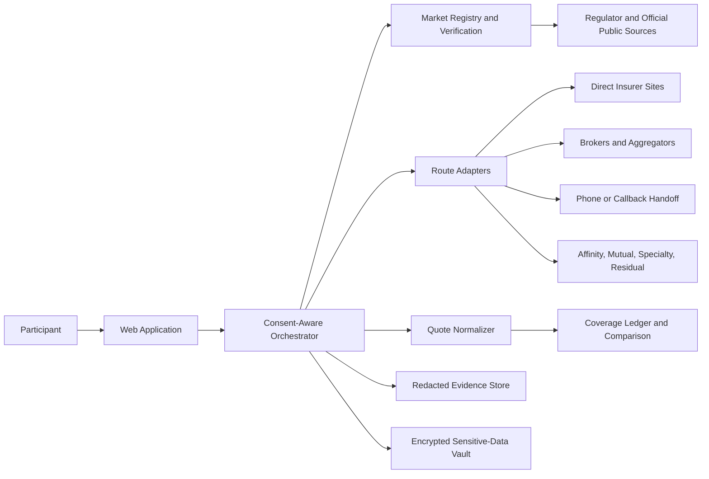
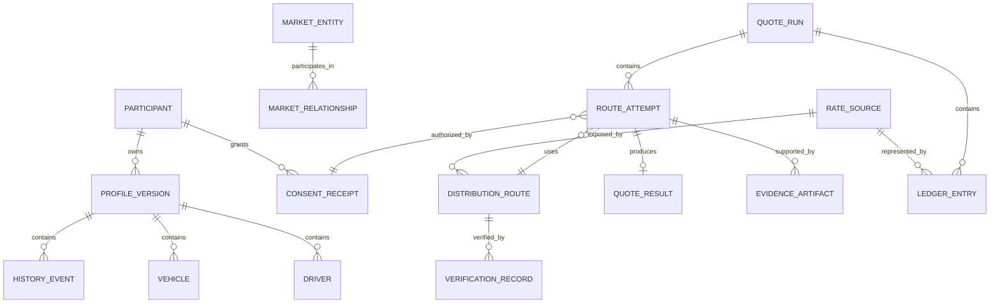
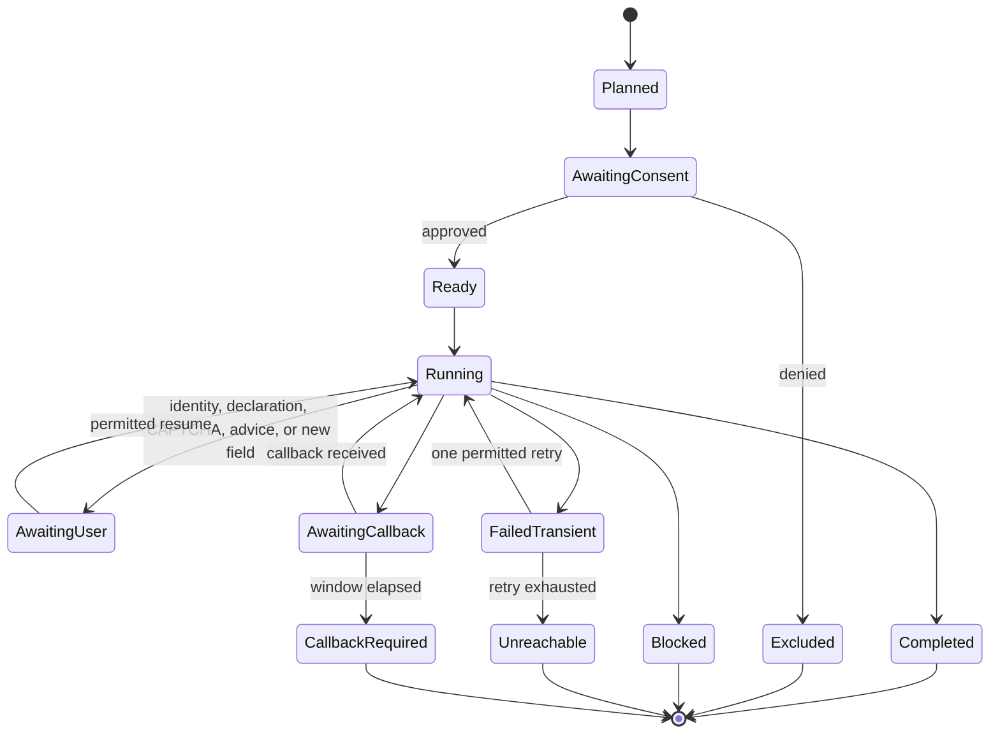

# Ontario Auto Insurance Information Collection System — Design Document

## 1. Document Purpose

This document defines the technical and product design for a personal-use system that collects Ontario private-passenger automobile insurance information, validates insurance providers and intermediaries, obtains or coordinates quotes, normalizes the results, and presents an evidence-backed comparison.

The system is designed for one Ontario resident shopping for their own insurance. It is not a public quoting service, an insurance brokerage, a policy-binding system, or a source of licensed coverage advice. Its primary quality objective is trustworthy, comparable, auditable information rather than the largest possible number of displayed prices.

## 2. Goals and Non-Goals

### 2.1 Goals

The system shall:

1. Collect the participant's profile once using an OAF 1-aligned canonical schema.
2. Discover and maintain a registry of distinct Ontario automobile insurance rate sources.
3. Verify that an insurer, broker, agent, program, or other route is legally valid, currently relevant, and accessible for the participant's risk.
4. Route the participant to direct writers, agents, brokers, aggregators, affinity programs, mutuals, specialty programs, and the residual market as appropriate.
5. Obtain quotes or exact terminal outcomes without bypassing destination controls.
6. Normalize coverage, premium, fees, discounts, and validity information.
7. Deduplicate consumer routes that resolve to the same underlying rate source.
8. Preserve redacted evidence and a complete audit trail for each result.
9. Make unresolved markets, coverage differences, and confidence levels visible.
10. Protect identity, licence, vehicle, household, claims, and contact information throughout the workflow.

### 2.2 Non-Goals

The system shall not:

- Serve people other than the participant or use another person's information without consent.
- Recommend which insurance coverage is suitable.
- Sell, bind, purchase, renew, cancel, or modify a policy.
- Submit payment, signatures, declarations, or purchase confirmations.
- represent a lead estimate or callback promise as an exact quote.
- Bypass CAPTCHAs, authentication, bot controls, terms, or rate limits.
- Guarantee that every regulator-listed company writes new standard Ontario private-passenger business.
- Treat brands, brokers, aggregators, MGAs, or insurer groups as legal underwriters unless evidence supports that classification.

## 3. Users and Operating Modes

### 3.1 Primary user

The sole primary user is an Ontario resident using the system for their own insurance-shopping activity. A licensed representative may participate through a handoff, but is not an application user in the prototype.

### 3.2 Modes

| Mode | Allowed data and behavior | Required label |
|---|---|---|
| `live_quote` | Uses the participant's legal identity and accurate risk information after explicit route-level consent. | Exact result status, such as `quoted_comparable` or `manual_handoff` |
| `discovery` | May use an alias only where no identity verification, declaration, callback, or truth attestation occurs and destination terms permit it. | `estimate_only`, `blocked`, or `manual_handoff` |
| `estimate_demo` | Uses a clearly hypothetical profile only in a local sandbox or expressly permitted non-binding estimate flow. | `estimate_only` |

A mode state machine prevents a hypothetical or alias-based session from entering identity lookup, consent attestation, callback, purchase, or policy application steps. A live route cannot start until the participant confirms the profile is accurate.

## 4. Design Principles

1. **Evidence before claims.** A market relationship, licence status, quote, blocker, or coverage term is not accepted without a source and verification time.
2. **Coverage before price.** The comparison UI displays material coverage differences before ranking premiums.
3. **Legal entity separation.** Legal underwriter, insurer group, consumer brand, distributor, aggregator, MGA/program, and residual-market route are stored separately.
4. **Distinct rate-source accounting.** Multiple websites or brands that produce the same underlying rate program count once in market coverage metrics.
5. **Consent at the point of disclosure.** Intake consent does not authorize every later data transfer. The user approves the exact destination and field set before submission.
6. **Human control at consequential boundaries.** Identity lookups, declarations, advice, CAPTCHA, and quote-to-purchase transitions stop for a human.
7. **Data minimization.** A route receives only the fields it requires; sensitive values do not enter model prompts, logs, analytics, screenshots, or source control.
8. **Bounded automation.** Retries are limited and explicit access restrictions are terminal outcomes, not obstacles to evade.
9. **Honest uncertainty.** `unresolved` remains visible and is never silently converted to unavailable or removed from the denominator.

## 5. System Context



The orchestrator never reads raw sensitive values unless a route requires them. It resolves approved field tokens from the vault immediately before submission and discards working copies afterward.

## 6. Proposed Architecture

The prototype uses a modular monolith with background workers. This provides strong transactional consistency and simple deployment while retaining clear boundaries that can later become services.

### 6.1 Logical components

| Component | Responsibility |
|---|---|
| Web application | Intake, consent, route review, checkpoints, progress, comparison, evidence viewing, and deletion controls. |
| Intake service | Validates and versions the canonical OAF 1-aligned profile. Tracks field provenance and household consent. |
| Consent service | Creates immutable consent receipts for modes, channels, destinations, fields, lookup permission, callback, and recording/transcription. |
| Market registry | Stores entity relationships, distribution routes, product scope, access requirements, status, evidence, and freshness. |
| Provider verification engine | Confirms legal existence/licensing, intermediary registration, current business status, product relevance, route ownership, and evidence freshness. |
| Route planner | Selects accessible routes, performs preflight eligibility, suppresses duplicates, and creates an ordered execution plan. |
| Route adapter framework | Maps canonical fields to destination questions and captures structured outcomes. Supports browser, approved API, broker, manual, and voice handoff adapters. |
| Workflow engine | Executes resumable state machines, bounded retries, checkpoints, timeouts, and callbacks. |
| Quote normalizer | Converts results into a common coverage and price schema and computes comparability differences. |
| Coverage ledger | Maintains one terminal outcome per verified applicable distinct rate source. |
| Evidence service | Redacts artifacts, computes hashes, stores metadata, and links evidence to verification and route attempts. |
| Vault and tokenization layer | Encrypts sensitive fields and provides short-lived, destination-scoped access. |
| Audit service | Records append-only security and business events without sensitive payloads. |
| Retention service | Enforces short retention, one-click deletion, artifact expiry, and deletion receipts. |

### 6.2 Suggested implementation stack

The design is technology-neutral, but a practical prototype can use:

- React or Next.js with TypeScript for the user interface.
- A TypeScript application service with a durable job/workflow queue.
- PostgreSQL for relational records and JSON coverage extensions.
- An encrypted object store for redacted evidence.
- A managed key service for envelope encryption and key rotation.
- Playwright or equivalent browser automation only on destinations where automation is permitted.
- Approved telephony integration for disclosed calls and consent-gated recording/transcription.

No provider-specific private endpoint is used unless the endpoint owner has authorized it.

## 7. Core Domain Model

### 7.1 Entity relationship overview



### 7.2 Canonical profile

`ProfileVersion` is immutable after a quote run begins. Corrections create a new version so results can be traced to the exact submitted facts.

Major groups are:

- Participant identity, contact, language, address, and household.
- Driver licence identity, licensing timeline, training, assignments, and discount eligibility.
- Vehicle identity, ownership, use, garaging, risk details, modifications, and special uses.
- Current insurance, cancellations, suspensions, fraud or misrepresentation findings, accidents, claims, and convictions with required lookback periods.
- Coverage benchmark, effective date, optional benefits, endorsements, deductibles, payment preference, and telematics choice.

Each field records `value_token`, `sensitivity`, `source`, `collected_at`, `verified_at`, and `required_consents`. The database stores a vault token rather than plaintext for highly sensitive fields such as licence number, birth date, full address, VIN, and detailed claims history.

### 7.3 Market model

`MarketEntity` has an explicit type:

```text
LEGAL_UNDERWRITER | INSURER_GROUP | CONSUMER_BRAND | DISTRIBUTOR |
AGGREGATOR | MGA_PROGRAM | MUTUAL | RESIDUAL_MARKET
```

`MarketRelationship` represents evidence-backed relationships such as `OWNED_BY`, `UNDERWRITTEN_BY`, `DISTRIBUTED_BY`, `APPOINTED_WITH`, `MEMBER_OF_PANEL`, or `ADMINISTERED_BY`. Every relationship includes source, effective dates where known, verification time, confidence, and an evidence artifact.

`RateSource` is the unit used for deduplication and coverage metrics. Its stable `distinct_rate_source_id` represents an underwriting/rating program, not merely a brand or URL. A route can expose several rate sources, and several routes can expose the same rate source.

### 7.4 Required registry record

```json
{
  "registry_id": "reg_...",
  "legal_underwriter": "Legal company name",
  "insurer_group": "Operating group",
  "brand_or_program": "Consumer-facing route",
  "distribution_type": "direct",
  "product_scope": "standard_PPA",
  "distinct_rate_source_id": "rate_...",
  "quote_url": "https://official.example/quote",
  "public_phone_route": "+1-...",
  "licensed_intermediary": null,
  "requirements": ["licence", "VIN"],
  "automation_notes": "Human handoff before declaration",
  "status": "verified_accessible",
  "source_url": "https://authoritative.example/evidence",
  "last_verified_at": "2026-08-09T18:00:00Z",
  "evidence_artifact_id": "ev_..."
}
```

Additional fields include known panel source, callback details, geographic and underwriting eligibility, new-business status, verification expiry, terms review, and requirement flags.

## 8. Insurance Provider Validity Verification

Provider validation is deliberately separate from quote acquisition. A route may be legally valid but not write relevant new business, or it may be a legitimate distributor without being the underwriter.

### 8.1 Validation dimensions

| Dimension | Question | Preferred evidence |
|---|---|---|
| Legal identity | Does the legal underwriter exist under its current name? | Ontario regulator or other authoritative public registry |
| Authority and licensing | Is the insurer authorized for the relevant class, and is the intermediary registered? | Official insurer and broker/agent regulator records |
| Current state | Is the record active, amalgamated, renamed, withdrawn, or restricted? | Regulator notices, official corporate disclosure |
| Product relevance | Does it offer applicable Ontario private-passenger automobile insurance? | Official product pages, filings, or documented licensed-representative response |
| New-business availability | Is the relevant product currently accepting new business? | Official route or timestamped representative confirmation |
| Route authenticity | Is the website, phone number, broker, or program an official or appointed route? | Official domain/contact page and intermediary disclosure |
| Underwriting relationship | Which legal company actually underwrites the returned product? | Quote disclosure, policy wording, program disclosure, or representative confirmation |
| Accessibility | Can this participant lawfully access it given territory, membership, risk, and channel? | Published eligibility and participant-specific outcome |
| Freshness | Is the evidence recent enough for planning? | Verification timestamp and configured time-to-live |

### 8.2 Verification workflow

1. Import the regulatory seed as `unverified`; never expose it as confirmed market availability.
2. Resolve the current legal name and entity status.
3. Verify the applicable insurance class and Ontario authority.
4. For a broker or agent route, verify intermediary registration and status independently.
5. Verify product scope and whether the provider writes new relevant business.
6. Verify the official public route, domain, phone number, panel, membership rules, and human requirements.
7. Capture the legal underwriter from authoritative disclosure or the returned quote rather than inferring it from the brand.
8. Assign or reconcile the `distinct_rate_source_id`.
9. Save source URL, retrieval timestamp, evidence hash, redacted artifact, and confidence.
10. Set a freshness deadline. Expired records return to `verification_due` before a new run.

### 8.3 Verification decisions

Registry verification status is separate from quote terminal status:

```text
unverified -> verifying -> verified_accessible
                        -> verified_conditional
                        -> not_relevant
                        -> not_currently_writing
                        -> unresolved
                        -> verification_due
```

`verified_conditional` covers valid routes that require membership, specialty risk, a licensed broker, or another condition. A marketing claim about the number of providers is never accepted as panel evidence. Aggregator and broker panels are timestamped and reconciled against the actual underwriter returned for the participant.

### 8.4 Confidence scoring

- **High:** current regulator evidence plus official provider/intermediary disclosure, or an exact quote naming the legal underwriter.
- **Medium:** documented confirmation from a licensed representative with a current registry record.
- **Low:** an official marketing/product page without sufficient evidence of current new-business access.

Low-confidence records remain discoverable but cannot be counted as verified applicable sources until resolved.

## 9. Intake and Consent Design

### 9.1 Progressive intake

The UI first collects common information, then asks route-specific questions only after the route planner finds a genuine requirement. Field-level validation covers Ontario postal codes, licensing sequence, dates, percentages, mileage, VIN shape, history lookbacks, household-driver allocation, and contradictory answers.

The participant reviews a concise accuracy summary before a live run. Other household drivers' details are disabled until their consent is recorded or the user excludes routes requiring that information.

### 9.2 Route-level disclosure preview

Before any destination receives data, the UI presents:

- Destination brand, legal underwriter if known, intermediary, and channel.
- Exact profile fields to be disclosed, grouped by sensitivity.
- Purpose of the disclosure and expected outcome.
- Whether a licence/VIN lookup, callback, or human interaction may occur.
- Evidence and retention policy.
- Controls to approve, deny, or exclude the route.

Consent is captured as an immutable receipt containing participant, profile version, route, field identifiers, purposes, channels, timestamp, policy/notice version, and expiry. Consent can be withdrawn for future steps but historical audit facts remain in a separate minimal compliance record.

## 10. Route Planning and Execution

### 10.1 Planning algorithm

The planner:

1. Loads fresh, verified registry records.
2. Applies hard eligibility filters such as Ontario territory, vehicle/use class, affinity membership, collector/high-net-worth conditions, and non-standard need.
3. Groups routes by `distinct_rate_source_id`.
4. Prioritizes official direct routes, then broad licensed broker/aggregator routes, independent verification, and gap-fill routes.
5. Selects a primary route for each source and retains alternatives as fallback or validation paths.
6. Estimates required fields and requests missing data progressively.
7. Presents the plan and disclosure scopes for user approval.
8. Creates one coverage-ledger placeholder for every verified applicable source, including sources that may remain unresolved.

Selection favors routes with exact online quotes, matching benchmark support, fresh verification, low disclosure burden, and permitted automation. It does not prefer a route merely because its marketing suggests a lower price.

### 10.2 Route adapter contract

Every adapter implements:

```text
preflight(profile_metadata) -> eligibility and required field IDs
prepare(consent_receipt, field_tokens, benchmark) -> execution plan
execute(checkpoint_callback) -> progress events
capture() -> raw structured result and artifact candidates
normalize(raw_result) -> canonical result
resume(handoff_context) -> continued attempt
cancel(reason) -> terminal state
```

Adapters cannot retrieve vault values until a valid consent receipt is supplied. Browser adapters use public user journeys. Broker and callback adapters create structured handoff packages. Voice adapters use approved public sales routes and disclose automation at the start.

### 10.3 Route attempt state machine



### 10.4 Human checkpoints

Execution pauses before:

- Legal-name or driver-licence database lookup.
- Consent to third-party records or identity verification.
- Any declaration, attestation, signature, or application submission.
- Coverage suitability advice.
- CAPTCHA or access restriction.
- Payment, binding, purchase, or quote-to-policy transition.

At a CAPTCHA, the system hands control to the user only where terms permit and does not solve or bypass the challenge. At a declaration or purchase boundary, the automation does not resume past the boundary.

### 10.5 Cross-channel handoff

A handoff package contains route ID, public contact route, quote/reference ID, completed non-sensitive answers, encrypted field references, consent state, unresolved questions, requested benchmark, source URL, timestamps, and prior evidence. The UI shows the package before it is shared.

For calls, the assistant identifies itself as automated, states its purpose, and offers transfer to the participant. Recording or transcription begins only after affirmative consent from the other party. If consent is refused, only structured non-audio notes are retained. Requests to stop are immediately terminal and no repeated calls are made.

## 11. Quote Capture and Normalization

### 11.1 Canonical quote result

Each result includes:

- Source identity: registry, brand, legal underwriter, insurer group, intermediary, and distinct rate source.
- Outcome: terminal status, exact/estimate flag, eligibility, reason, and next action.
- Price: annual and monthly premium, deposit, installments, finance charge, fees, taxes, total cost, and currency.
- Coverage: liability, accident benefits, uninsured automobile, DCPD, own damage, deductibles, endorsements, and optional benefits.
- Discounts: applied, available, conditional, membership, bundle, and telematics.
- Validity: reference ID, requested effective date, expiry/guarantee date, and verification caveats.
- Evidence: timestamp, route, source, redacted artifact, and hash.
- Privacy: disclosed field IDs, consent receipt, and retention deadline.
- Confidence: high, medium, or low with reason.

### 11.2 Benchmark coverage

The default demonstration benchmark is:

- Twelve-month term and common requested effective date.
- $2 million third-party liability.
- DCPD included.
- Mandatory medical, rehabilitation, and attendant-care accident benefits.
- Collision and comprehensive with $1,000 deductibles.
- OPCF 44R where offered.
- No telematics unless separately opted into.

This is a comparison configuration, not advice. After July 1, 2026, each optional accident benefit is explicitly recorded as `included`, `excluded`, `unavailable`, or `unknown`. The schema also tracks OPCF 20, 27, 43, and 44R, DCPD opt-out/OPCF 49 implications, benefit limits, and all own-damage deductibles.

### 11.3 Comparability algorithm

The normalizer compares every field against the versioned benchmark:

1. Convert all premium components to annual total cost without hiding installment charges.
2. Compare effective date and term.
3. Compare liability limits, accident benefits, DCPD, own-damage coverages, deductibles, and endorsements.
4. Classify differences as `material`, `conditional`, `unknown`, or `display_only`.
5. Set `quoted_comparable` only for an exact premium with no material or unknown benchmark difference.
6. Otherwise preserve the price as `quoted_non_comparable` and list every variance.
7. Keep estimates outside exact-quote ranking by default.

The system never silently fills a missing coverage value from a provider's generic product description.

## 12. Terminal Outcomes and Coverage Ledger

Every planned distinct source receives one evidence-backed outcome:

`quoted_comparable`, `quoted_non_comparable`, `estimate_only`, `callback_required`, `manual_handoff`, `ineligible`, `affinity_restricted`, `specialty_only`, `duplicate_rate_source`, `not_currently_writing`, `blocked`, `unreachable`, or `unresolved`.

The coverage ledger is the authoritative view of market reach. It retains primary and alternate routes, evidence, applicability decision, terminal status, attempt count, timestamp, and unresolved next action. A duplicate brand is linked to the canonical source rather than counted as another market.

## 13. User Experience

### 13.1 Main screens

1. **Scope and safety:** explains personal-use limits, no advice or purchase, and supported modes.
2. **Profile intake:** progressive OAF 1-aligned questionnaire with completion and consent indicators.
3. **Coverage benchmark:** user-selected comparison assumptions with a clear no-advice notice.
4. **Market map:** legal underwriter, group, brand/program, distributor, source, validation status, and freshness.
5. **Route plan and consent:** destinations, required fields, disclosure scopes, and route exclusion.
6. **Run monitor:** state, attempts, checkpoints, callback windows, and exact blockers.
7. **Comparison:** coverage differences first, then annual total cost; estimates excluded by default.
8. **Evidence drawer:** redacted artifact, source, timestamp, reference ID, hash, and confidence.
9. **Coverage ledger:** applicable, duplicate, conditional, unresolved, and terminal markets.
10. **Privacy center:** retained data, consent receipts, expiry dates, and one-click deletion.

### 13.2 Comparison behavior

Users can sort exact comparable results by annual total cost, filter estimates, inspect payment charges and conditional discounts, and open every variance. The interface uses “lowest comparable annual cost,” never “best insurance.” Non-comparable results are visually separated and cannot win the default price sort.

## 14. APIs and Internal Events

Representative application endpoints are:

```text
POST   /profiles
POST   /profiles/{id}/versions
POST   /consents/preview
POST   /consents
GET    /markets?status=&scope=&fresh=
POST   /markets/{id}/verify
POST   /quote-runs/plan
POST   /quote-runs
GET    /quote-runs/{id}
POST   /attempts/{id}/checkpoint-response
POST   /attempts/{id}/cancel
GET    /quote-runs/{id}/comparison
GET    /quote-runs/{id}/ledger
GET    /evidence/{id}
DELETE /participants/{id}/quote-data
```

Key events include `ProfileVersionCreated`, `ConsentGranted`, `MarketVerified`, `PlanApproved`, `RouteStarted`, `CheckpointRaised`, `HandoffCreated`, `QuoteCaptured`, `EvidenceRedacted`, `ResultNormalized`, `LedgerUpdated`, `RetentionExpired`, and `DeletionCompleted`. Event payloads contain identifiers and classifications, never raw sensitive values.

## 15. Data Protection and Security

### 15.1 Data classification

| Class | Examples | Handling |
|---|---|---|
| Restricted | Licence number, birth date, full address, VIN, detailed claims, voice | Field-level encryption, vault tokenization, strict purpose access, shortest retention |
| Confidential | Contact details, policy/reference ID, premiums, household relationships | Encryption, access control, redacted display/logging |
| Internal | Route plan, eligibility rules, operational metrics | Authenticated access and integrity controls |
| Public | Official URLs and public registry facts | Source and freshness tracking |

### 15.2 Controls

- Envelope encryption at rest and TLS in transit.
- Per-environment keys and least-privilege service identities.
- Short-lived destination-scoped vault grants.
- No restricted values in model prompts, traces, analytics, exception messages, screenshots, or call metadata.
- Automatic masking before rendering and evidence capture.
- Content inspection after redaction; artifacts failing inspection are quarantined rather than saved.
- Append-only access logs and evidence hashes.
- CSRF protection, secure sessions, rate limiting, and administrative role separation.
- Secrets from environment/secret management only, never repository files.
- One-click deletion covering vault data, artifacts, working state, and quote records, followed by a deletion receipt.
- Hackathon quote data expires after judging unless the participant explicitly selects a different permitted retention period.

Consent receipts, security access logs, and deletion proofs are stored separately from quote display data and contain only the minimum identifiers required for accountability.

## 16. Evidence and Auditability

An evidence artifact has `artifact_id`, attempt/verification link, type, capture time, source, redaction version, content hash, storage location, retention deadline, and access classification. Supported artifacts include redacted screenshots, structured call notes, official-page extracts, response references, and broker confirmations.

The evidence pipeline is:

```text
capture candidate -> isolate sensitive regions -> redact -> inspect -> hash -> encrypt -> store -> link
```

Raw page captures and unconsented audio are never retained. Each audit chain links profile version, registry entry, consent receipt, disclosed field identifiers, attempt state transitions, result, normalization differences, and evidence. Hash verification detects later artifact modification.

## 17. Reliability and Error Handling

- Workflows are durable and idempotent; a restart resumes from the last committed safe state.
- Partial form progress, source URL, consent state, reference ID, and handoff context are preserved.
- Web routes receive one normal attempt and one retry only for a transient technical failure.
- A rejection, CAPTCHA, terms restriction, or ineligibility is not retried.
- Outbound voice receives one call during published hours and one retry only if the line fails before connection.
- Callback windows are persisted; expiration produces `callback_required` or `unreachable` with timestamps.
- Broker routes request the complete carrier list and all outcomes once.
- Parser or schema uncertainty produces `unresolved` or an `unknown` coverage field, never an invented value.
- Circuit breakers prevent repeated calls to failing destinations.

## 18. Observability and Metrics

Operational telemetry excludes personal facts and sensitive identifiers. Required product metrics are:

```text
market_completion = sources with evidence-backed terminal status
                    / verified applicable distinct sources

comparable_quote_yield = quoted_comparable
                         / verified applicable distinct sources

evidence_rate = outcomes with valid source, timestamp, and redacted artifact
                / all outcomes

freshness = registry records verified during the target window
            / registry records in scope
```

Duplicate suppression is reported as the number of brands/routes mapped to existing distinct source IDs. Operational metrics include checkpoint latency, route success by adapter, callback aging, retry count, artifact-redaction failures, stale registry count, and deletion completion time.

## 19. Testing Strategy

### 19.1 Automated tests

- Unit tests for validation, lookback windows, route eligibility, source deduplication, price annualization, coverage differences, statuses, and redaction rules.
- Contract tests for each adapter using synthetic responses and destination-specific fixtures that contain no real identifiers.
- State-machine tests for pauses, retries, callbacks, cancellation, and restart recovery.
- Security tests for authorization, vault grant scope, log leakage, artifact quarantine, and deletion.
- Property-based tests ensuring no estimate becomes an exact quote and no unresolved source disappears from ledger denominators.
- Migration tests for registry relationship and coverage schema changes.

### 19.2 Integration and acceptance tests

The minimum demo test uses a permitted route to return a rate or exact blocker, normalizes two outcomes, preserves one no-quote/handoff outcome, and demonstrates context continuity across a browser-to-human or callback boundary. Every demonstrated outcome must have a timestamp and redacted evidence.

No test fixture contains a real licence number, full address, payment data, or unredacted recording. Live tests use only the participant's accurate information and stop at every required checkpoint.

## 20. Deployment and Operations

Use separate local/demo and live configurations. Demo mode has only synthetic data and disabled external submission. Live mode requires authentication, participant confirmation, configured vault/KMS, approved route allowlist, retention policy, and an emergency stop.

A route adapter is disabled by default until its official route, terms posture, required checkpoints, and redaction map are reviewed. Feature flags can disable individual destinations without redeployment. Registry seed import and verification are versioned so a demo report can reproduce the exact market map used by a run.

Backups are encrypted and follow the same deletion and retention obligations. Production-style deployment requires documented incident handling, key rotation, access reviews, and privacy/legal assessment; the hackathon prototype must not be represented as production-ready telephony or insurance compliance infrastructure.

## 21. Delivery Plan

### Phase 1 — Safe foundation

- Canonical intake and benchmark schemas.
- Sensitive-data vault abstraction and masked UI.
- Consent receipts, audit events, and retention/deletion.
- Market registry with seed import and evidence fields.

### Phase 2 — Verification and planning

- Entity relationship model and provider verification workflow.
- Freshness and confidence rules.
- Distinct rate-source deduplication.
- Eligibility-aware route planning and disclosure preview.

### Phase 3 — Quote workflow

- One permitted browser/manual route adapter.
- Durable attempt state machine and human checkpoints.
- Structured blocker and handoff capture.
- Redaction and evidence storage.

### Phase 4 — Comparison and market coverage

- Canonical result normalizer and coverage-difference engine.
- Coverage ledger, metrics, and comparison UI.
- Second route and one context-preserving broker/callback/manual handoff.

### Phase 5 — Demo hardening

- End-to-end acceptance, security, deletion, and failure-recovery tests.
- Machine-readable registry export.
- Redacted run report and architecture/safety note.
- Three-to-five-minute walkthrough demonstrating evidence lineage and known limitations.

## 22. Key Risks and Mitigations

| Risk | Mitigation |
|---|---|
| Provider or panel information changes frequently | Store timestamps and evidence, use short freshness TTLs, and re-verify before each live run. |
| Duplicate brands inflate market coverage | Count only distinct rate-source IDs and show brand-to-source mappings. |
| Destination changes break automation | Adapter contracts, synthetic fixtures, feature flags, resilient selectors, and manual handoff. |
| Quotes appear comparable when coverage differs | Field-level benchmark comparison; unknown values force non-comparable status. |
| Sensitive data leaks into artifacts or telemetry | Vault tokens, denylisted logging, pre-storage redaction and inspection, quarantine on failure. |
| Automation crosses a legal or consequential boundary | Explicit state-machine checkpoints and irreversible stop at declaration/purchase. |
| Voice consent is ambiguous | Affirmative consent gate; otherwise retain structured notes only and no audio/transcript. |
| Unavailable markets are silently omitted | Coverage ledger placeholders and `unresolved` included in denominators. |
| User interprets ranking as advice | Coverage-first presentation, neutral labels, eligibility caveats, and licensed-professional handoff. |

## 23. Open Decisions and Known Limitations

- Exact authoritative source integrations and permissible automation must be confirmed during implementation.
- Rate-source identity can be difficult to prove before a returned disclosure; uncertain mappings remain unresolved.
- Broker and aggregator panels vary by time and participant eligibility and cannot establish total market reach alone.
- Some affinity, mutual, specialty, non-standard, and residual markets require a licensed human intermediary.
- CAPTCHAs, declarations, identity verification, and coverage advice prevent fully unattended execution.
- A quote can change after insurer verification; the UI must retain this caveat and validity period.
- Telephony recording and compliance requirements require jurisdiction-specific review beyond the prototype.
- Regulatory seed records are discovery inputs, not proof of current retail availability.

## 24. Acceptance Traceability

| Requirement area | Design realization |
|---|---|
| Single accurate intake | Immutable OAF 1-aligned profile versions and progressive route questions |
| Provider validity | Independent multi-dimensional verification with authoritative evidence and freshness |
| Quote comparison | Versioned benchmark, annual total-cost normalization, field-level variance engine |
| Market identity | Typed market entities, evidence-backed relationships, and distinct rate-source IDs |
| Web/voice/broker routing | Adapter framework, durable workflow, checkpoints, and handoff packages |
| Evidence | Redaction pipeline, hashes, artifact metadata, and linked audit chain |
| Privacy and consent | Route/field-level receipts, vault tokenization, minimization, retention, and deletion |
| Safe boundaries | No bypass, declaration, advice, payment, binding, or purchase behavior |
| Honest market reach | Coverage ledger, terminal statuses, unresolved preservation, and duplicate suppression |
| Demo readiness | Two normalized outcomes, one exact blocker/handoff, exports, report, and walkthrough plan |

## 25. Definition of Done

The initial implementation is complete when it can safely collect and version the participant's own profile, verify and display market entities without conflating their roles, generate an approved route plan, complete at least one permitted route to a quote or exact blocker, preserve a context-aware handoff, normalize at least two results, show every coverage variance, and produce a redacted evidence-backed ledger and report. It must also prove that restricted identifiers do not appear in logs or artifacts and that the one-click deletion flow removes retained quote data and produces a deletion record.
